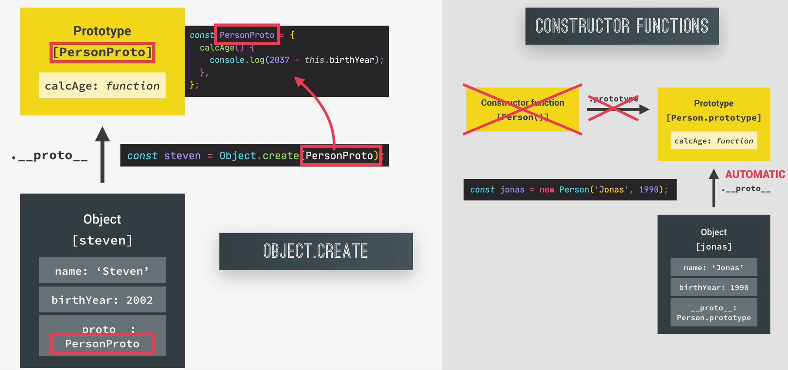
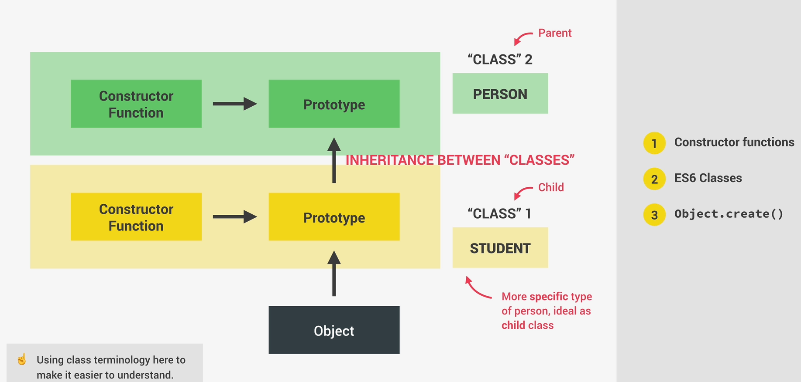
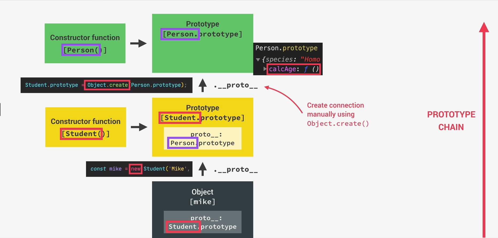
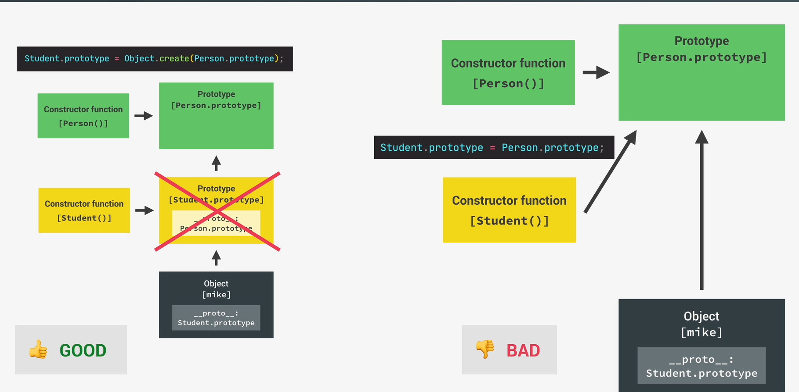
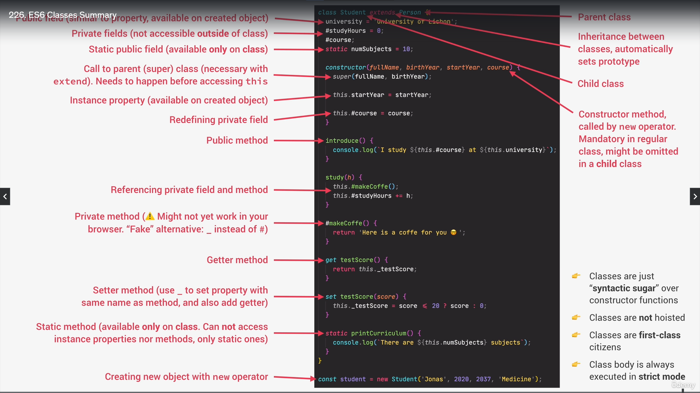

## What is Object-Oriented Programming?

OOP is a concept based on the concept of the objects
means style of code how we write and organize code

- we use objects in order to model(describe) real or abstract features

- objects can contain data or methods. When we use objects we pack data and the corresponding behavior into one block

- In OOP objects are self-contained pieces/blocks of code

- Objects are building blocks of applications and interact with one another

- interactions happen in public interface(API): methods that the code outside of the object can access and use to communicate with this object

- OOP was created in order to organize code, make it more flexible and easier to maintain

if we don't have OOP it makes hard to maintain this code because there are lots of functions in global scope and so on

class is a blueprint like instruction from which we can create new objects

Main idea is to create classes which generalizes functionality and data for example users we can create user class which contains name, email and password. Also function login and sendmessage for instance

The 4 fundamental principles  abstraction, encapsylation, inheriatnce and polymorphism

- Abstraction Ignoring and hiding details which don't matter, allowing us to get an overview perspection of the thing we are implmenting instead of messing with details that don't really matter to our implmentation

In general we just hide details which we don't need from user for example addEventListener function we just call it with two arguments we don't know how it works behind the scenes

- Encapsulation keep properties out of the class so they are not accesible from outside the class. Some methods can be exposed as a public interface

why? 

1. it prevents from bugs accidentally manipulating properties/state 
2. it allows to maintain code easier without the risk of its breaking

- Inheritance 

it is used to use one class as the main class and use then similar class to the previous one but with a bit different properties just additional properties 

- Polymorphism 

it means that the child classes can ovwerwrite methods that this class inherited from the parent class

## OOP in JavaScript

Prototype <-- Object 

Objects are linked to a prototype object

Prototypal inheritance: The prototype contains all methods which are accessible to all objects linked to that prototype

How do we implement OOP in js?

- Constructor functions:
1. Technique to create objects from a function

- ES6 Classes:

1. Modern alternative to constructor functions syntax 
2. Behind the scenes classes are working the same as constructor functions 
3. They don't behave like classes in classical oop

- Object.create()

1. The easiest way to link an object to prototype

## Constructor Functions and the new Operator
We build an object using a constructor function
constructor function is just a normal function but with the difference that we call it with new operator

<b>Constructor functions starts with Capital letter!</b>

Here is an example:
const Person = function() {

}

<b>Only function declarations or function expressions will work. Arrow function don't work</b>

const Person = function (name, birthYear) {
  this.name = name;
  this.birthYear = birthYear;
  console.log(this);
}

const jonas = new Person('Jonas', 1991);

if we pass property name we should give the property to this current object with the same property name because it is a right usecase

We can also check if variable is instance of some class for example
console.log(jonas instanceof Person) // true

console.log('check if prototype', Person.prototype.isPrototypeOf(jonas));
console.log('hasOwnProperty', jonas.hasOwnProperty('name')); // check if exists field with the name 'name' true

## Prototypal Inheritance and The Prototype Chain

Prototype chain it is when a current object is attcahed to prototype and the fact that this object can look up for the methods and prototypes it is named like prototype chain

Prototype chain we can also call like series of links between objects linked through prototypes

Here is an example object jonas has Person.prototype and Person.prototype has Object.prototype and if it has some methods it will also have prototypes but in general it points to null

hasOwnProperty is not copies to the object itself but it just inherits it that's why it is so cool to performance

## Prototypal Inheritance on Built-In Objects
functions are objects and on objects we can call methods as bind, apply or call methods

## ES6 Classes

There are two types of decalring classes class declaration and class expression

Here is an example:

// class expression
const PersonCL = class {

}

// class declaration

class PersonCl {
  constructor(firstName, birthYear) {
    this.firstName = firstName;
    this.birthYear = birthYear;
  }
}

Several rules, which you should keep in mind about classes:
<b>
1. Classes are not hoisted(that means that you can't use them before you declared it)
2. Classes are first-class citizens we can pass them into functions and return them from functions
3. Classes are executed in strict mode
</b>

## Setters and Getters

We type them just like normal functions but with key words get/set.

They can be very useful when we use data validation

## Static Methods

Static method means that it is attached to constructor but not in prototype
Here are some examples: 

Number.parseFloat(12) ---> it is not exist on usual numbers, but only on Number constructor function

## Object.create

##  Inheritance Between "Classes": Constructor Functions

For instance if we have class Person and class Student we can create inheeritance because Student is also subtype of Person. They have name, surname calcAge method but student can have their unique methods such as calcMark and number of course or group

## Inheritance Between "Classes": ES6 Classes

In ES6 classes you can easily inherit parent class you should just type extends

here is an example 

class Parent {
  constructor(name, surname, birthYear) {
    this.name = name;
    this.surname = surname;
    this.birthYear = birthYear;
  }

  calcAge() {
    return new Date().getFullYear() - this.birthYear;
  }
}

class Child extends Parent {
  constructor(name, surname, birthYear, gifts) {
    super(name, surname, birthYear);
    this.gifts = gifts;
  }
  // if we want to overwrite for example
  calcAge() {
    return 2037 - this.birthYear;
  }
}

We can call method calcAge but if we want to overwrite it we can easily do this

const nazar = new Child('Nazarchikk', 'Kosyk', 2003, 'PC');

nazar.calcAge();

## Inheritance Between "Classes": Object.create
It is not used widely as ES6 classes and constructor functions but nevertheless it also can be used

const PersonProto = {
  calcAge() {
    return new Date().getFullYear() - this.birthYear;
  },

  init(firstName, birthYear) {
    this.firstName = firstName;
    this.birthYear = birthYear;
  }
}

const Steven = Object.create(PersonProto);

const StudentProto = Object.create(PersonProto);

StudentProto.init = function (firstName, birthYear, course) {
  PersonProto.init.call(this, firstName, birthYear)
  this.course = course;
}

const jay = Object.create(StudentProto);
jay.init('Jay Stedhem', 2004, 'Actor');

## Encapsulation: Protected Properties and Methods

it means to keep some methods and properties hidden in class.

There are two big reasonst why we need Encapsulation:
1. To prevent our code accidentally manipulate our data outside from the class
2. We can change other code with more confidence because we know that it doens't rely on outer code so in the outer code we can't use inner methods in class

In js there is not actual encapsulation but if you want to mark that this variable shouldn't be used out of the class you can use underscore here is an example:

class Account {
  constructor(owner, currency, pin) {
    this.owner = owner;
    this.currency = currency;
    this._pin = pin;
    this._movements = [];
    this.locale = navigator.language;
    console.log(`Thanks for opening account, ${owner}`);
  }

  // Public interface
  getMovements() {
    
  }

  deposit(sum) {
    this._movements.push(sum);
  }

  withdrawal(sum) {
    this._movements.push(-sum);
  }
}

## Encapsulation: Private Class Fields and Methods

1. Public fields
2. Private fields
3. Public methods
4. Private methods

Here is an example on how we implment it:

class Account {
  //1. Public field
  locale = navigator.language;

  //2. Private fields
  #movements = []; // # in order to make them private
  #pin;

  constructor(owner, currency, pin) {
    this.owner = owner;
    this.currency = currency;
    this.#pin = pin;
    console.log(`Thanks for opening account, ${owner}`);
  }

  // Public interface
  //3. Public methods
  getMovements() {
    return this.#movements
  }

  deposit(sum) {
    this.#movements.push(sum);
    return this;
  }

  withdrawal(sum) {
    this.#movements.push(-sum);
    return this;
  }

  // 4. Private methods
  #approveLoan() {
    return true
  }
}

##  ES6 Classes Summary

