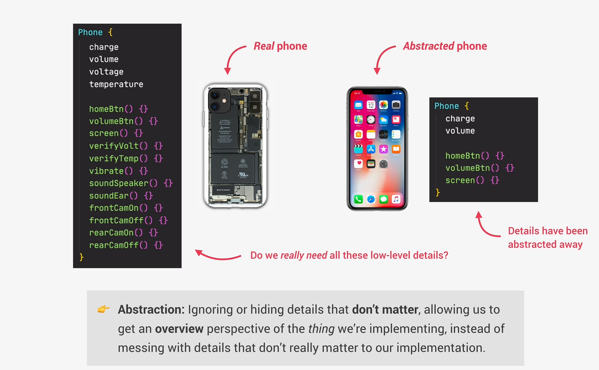
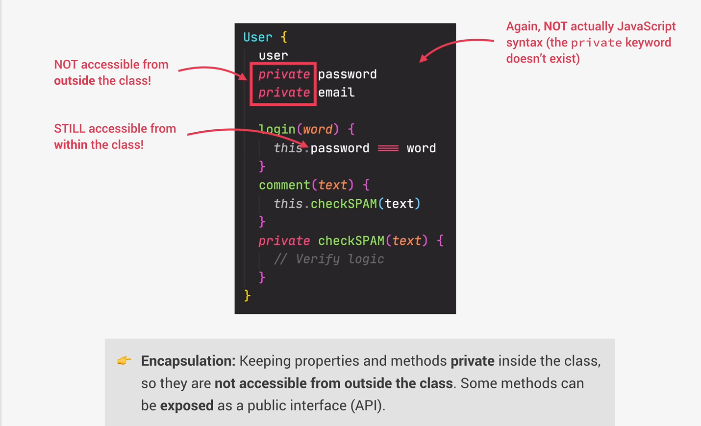
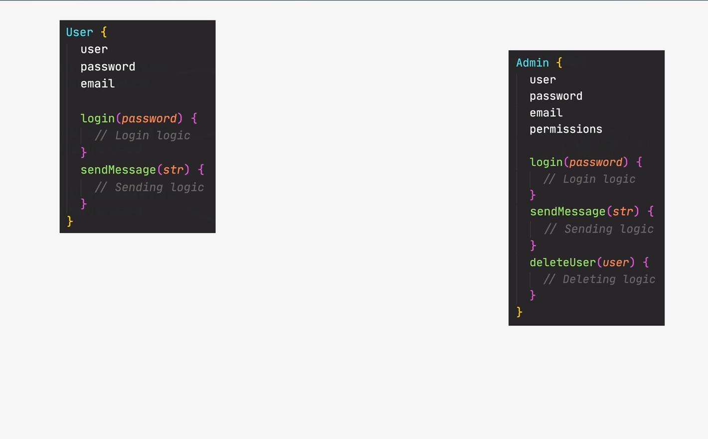
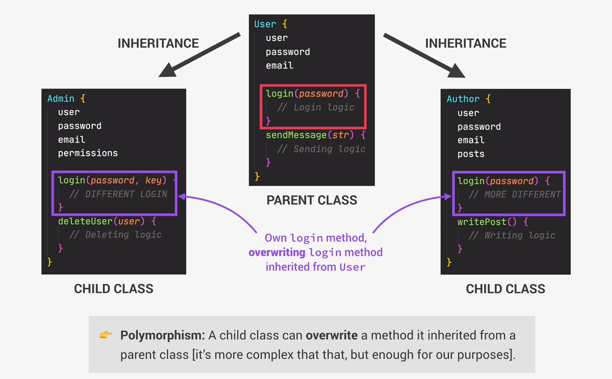
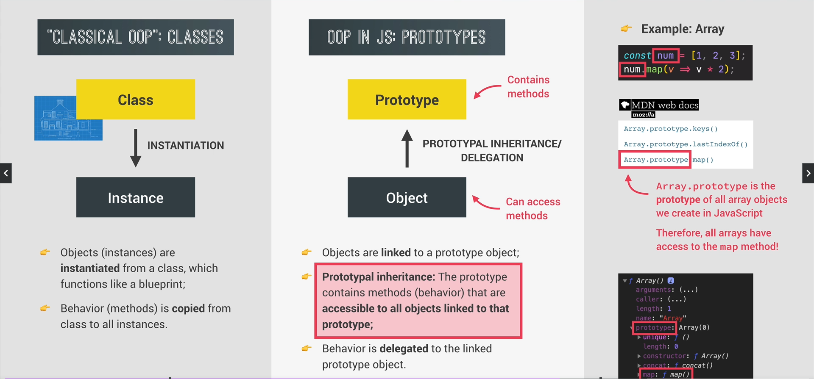
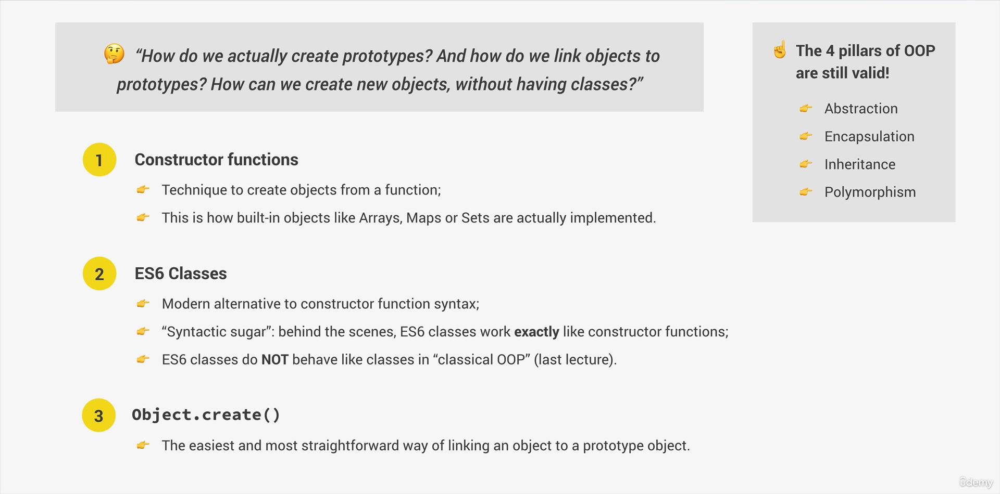
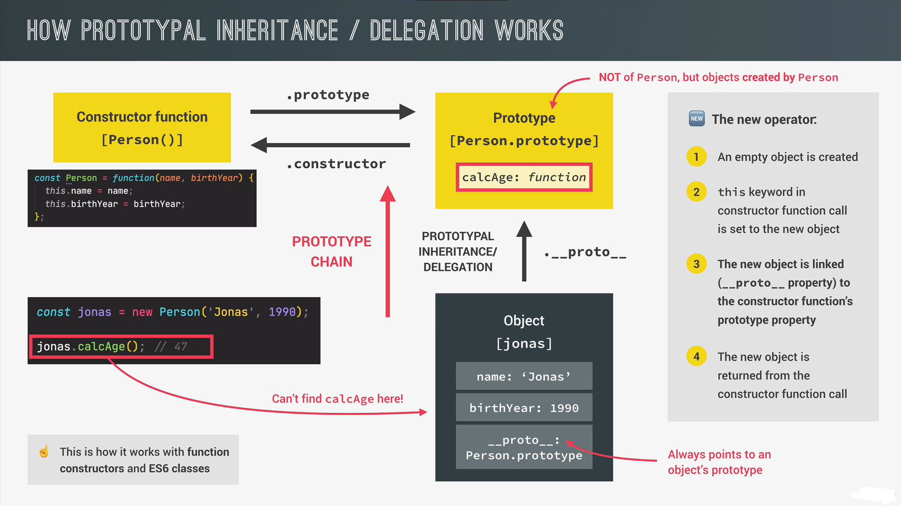
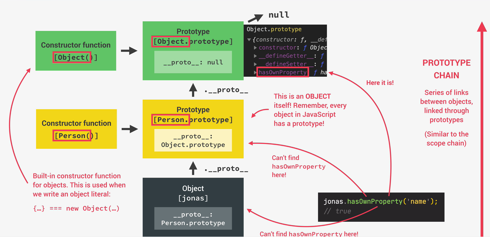

## What is Object-Oriented Programming?

OOP is a concept based on the concept of the objects
means style of code how we write and organize code

- we use objects in order to model(describe) real or abstract features

- objects can contain data or methods. When we use objects we pack data and the corresponding behavior into one block

- In OOP objects are self-contained pieces/blocks of code

- Objects are building blocks of applications and interact with one another

- interactions happen in public interface(API): methods that the code outside of the object can access and use to communicate with this object

- OOP was created in order to organize code, make it more flexible and easier to maintain

if we don't have OOP it makes hard to maintain this code because there are lots of functions in global scope and so on

class is a blueprint like instruction from which we can create new objects

Main idea is to create classes which generalizes functionality and data for example users we can create user class which contains name, email and password. Also function login and sendmessage for instance

The 4 fundamental principles  abstraction, encapsylation, inheriatnce and polymorphism

- Abstraction Ignoring and hiding details which don't matter, allowing us to get an overview perspection of the thing we are implmenting instead of messing with details that don't really matter to our implmentation

In general we just hide details which we don't need from user for example addEventListener function we just call it with two arguments we don't know how it works behind the scenes

- Encapsulation keep properties out of the class so they are not accesible from outside the class. Some methods can be exposed as a public interface

why? 

1. it prevents from bugs accidentally manipulating properties/state 
2. it allows to maintain code easier without the risk of its breaking

- Inheritance 

it is used to use one class as the main class and use then similar class to the previous one but with a bit different properties just additional properties 

- Polymorphism 

it means that the child classes can ovwerwrite methods that this class inherited from the parent class

## OOP in JavaScript

Prototype <-- Object 

Objects are linked to a prototype object

Prototypal inheritance: The prototype contains all methods which are accessible to all objects linked to that prototype

How do we implement OOP in js?

- Constructor functions:
1. Technique to create objects from a function

- ES6 Classes:

1. Modern alternative to constructor functions syntax 
2. Behind the scenes classes are working the same as constructor functions 
3. They don't behave like classes in classical oop

- Object.create()

1. The easiest way to link an object to prototype

## Constructor Functions and the new Operator
We build an object using a constructor function
constructor function is just a normal function but with the difference that we call it with new operator

<b>Constructor functions starts with Capital letter!</b>

Here is an example:
const Person = function() {

}

<b>Only function declarations or function expressions will work. Arrow function don't work</b>

const Person = function (name, birthYear) {
  this.name = name;
  this.birthYear = birthYear;
  console.log(this);
}

const jonas = new Person('Jonas', 1991);

if we pass property name we should give the property to this current object with the same property name because it is a right usecase

We can also check if variable is instance of some class for example
console.log(jonas instanceof Person) // true

console.log('check if prototype', Person.prototype.isPrototypeOf(jonas));
console.log('hasOwnProperty', jonas.hasOwnProperty('name')); // check if exists field with the name 'name' true

## Prototypal Inheritance and The Prototype Chain

Prototype chain it is when a current object is attcahed to prototype and the fact that this object can look up for the methods and prototypes it is named like prototype chain

Prototype chain we can also call like series of links between objects linked through prototypes

Here is an example object jonas has Person.prototype and Person.prototype has Object.prototype and if it has some methods it will also have prototypes but in general it points to null

hasOwnProperty is not copies to the object itself but it just inherits it that's why it is so cool to performance

## Prototypal Inheritance on Built-In Objects
functions are objects and on objects we can call methods as bind, apply or call methods

