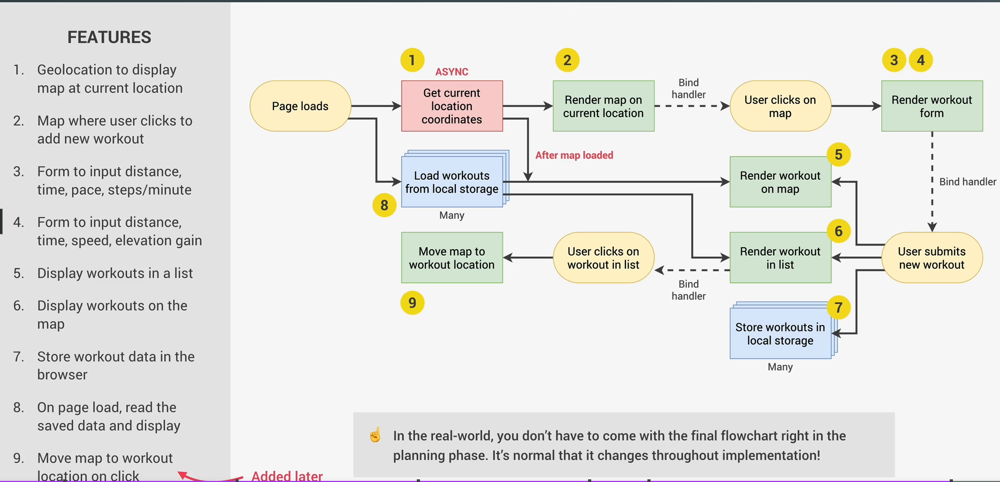

## How to Plan a Web Project

1. User stories

it is description of application from the user's side. All user stories are put together to describe the entire application
Common format: As a [type of user], i want [an action] so that [a benefit]
                      Who?                  What?                  Why?

2. Features

What we will build?
3. Flowchart

How we build it?
4. Architecture

it means how we organize our code and what js features will we use

All these four steps are planning steps and then we go into development step - implementation of our plan using code

Example on Mapty OOP:

1. User stories:

- As a user, i want to log my running workouts with location, distance, time, pace and steps/minute, so i can keep a log of all my running
- As a user, i want to log my cycling workouts with location, distance, time, speed and elevation gain, so i can keep a log of all my cycling
- As a user, i want to see all my workouts at a glance, so i can easily track my progress over time
- As a user i want to see all my workouts on a map, so i can easily check where i work out the most 
- As a user i want to see all my workouts when i leave this app and come back later so that i can keep using this app over time 

2. Features: 

- Map where user clicks to add new workout (best way to get location coordinates)
- Geolocation to display map at current location (more user friendly)
- form to input distance, time pace, steps/minute 
- form to input distance, time, speed, elevation gain
- display all workouts in a list
- display all workouts on a map
- store workout data in the browser using local storage API
- On page load, read saved data and display it 

3. Flowchart

