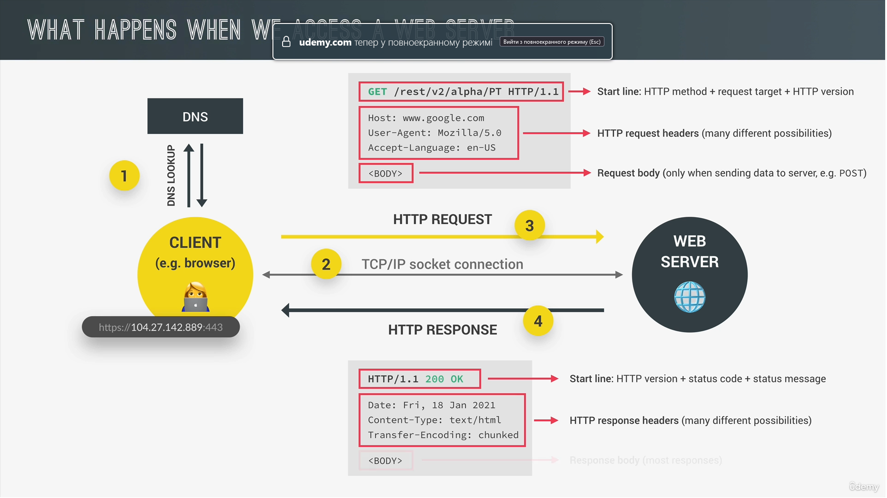
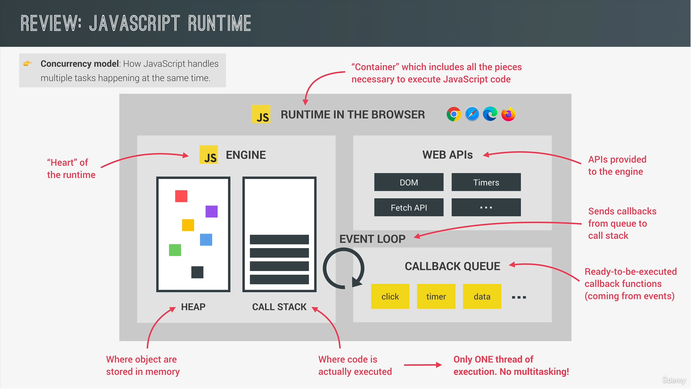
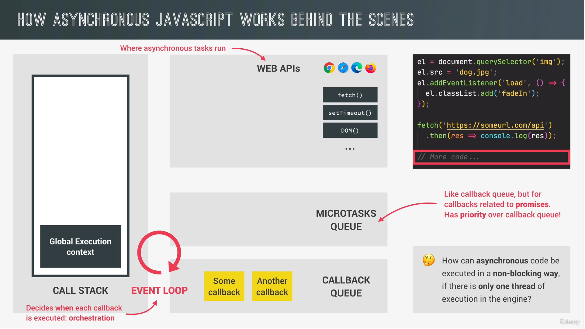

## Async js Ajax 

Synchrounous js

- It is when each line of code is executing line by line
- next line is executing only after the previous line is ready
- if long event happens it impacts badly on performance on webpage
- long-running operations actually blocks code execution 👎 

Async js
- it is non-blocking, so it does'nt block any evsnt which happens after
- code executes further, execution doesn't wait for async code to finish it executes further
- callback functions alone are not async 

Here is an example:

const p = document.querySelector('p'); // 1 
setTimeout(() => {
console.log("My name is Marik");
}, 5000) // await 5 seconds 3
p.style.color = "red" // 2 

If we had more lines of code we would still execute them until 5 seconds left

Ajax

Asynchrounous javascript and xml. It allows us to connect to web servers in an async way and request for data. In order to do it dynamically

Api it is a piece of software that can be used by another piece of software in order to communicate with each other. 

Online api that is a web server which gives data as response when we make a request to it.

## OPTIONAL How the Web Works: Requests and Responses

tcp - transmition control protocol, it defines how data travels accross the browser
http - hypertext transfer protocol. It allows clients and servers to communicate

Fetch 

When we fetch api we immediately return promises
Promises can be two types. They have two states: pending and settled. 

Pending is when task is not finished yet and settled it is the finshed task with positive or negative result. 

In most cases we don't build options for promises but sometimes you can need it 

## Consuming promises 

When returns postive fulfilled response we use then method in order to make further steps. 

fetch('some url').then((response) => {
console.log("It is successful promise", response) // but we can't read property body. In order to read it we should use json method, which returns a new promis which we also should handle 

return response.json();
}).then((data) => {
console.log("Needed data", data);
}).catch((error) => {
console.log("it is promise with error", error)
}) 

## Chaining promises 

If you have to handle one error you can do like this 

fetch("some url").then(response => response.json(), err => console.log(err)).then(data => console.log(data))

But if you need to handle all errors just catch at the end of request 

fetch("some url").then(response => response.json()).then(data => console.log(data)).catch(err => console.log(err)) 

Any error has property message
You can type like this: 

console.log(err.message) 

Moreover, there is one more interesting method: 

fetch("some url")
.then(response => response.json())
.then(data => console.log(data))
.catch(err => console.log(err))
.finally(() => {
console.log("This executes no matter if request is fullfilled or not. Good example of using is to stop loader")
})

## Throw errors manually 

const apiCall = (countryName) => {
fetch(some url/${countryName})
.then(response => {
if(!response.ok) return throw new Error("Country was not found"); 

return response.json();
})
.then(data => console.log(data))
.catch(err => console.log(err))
.finally(() => {
console.log("This executes no matter if request is fullfilled or not. Good example of using is to stop loader")
})

} 

apiCall("notExist")

## Asynchronous Behind the Scenes: The Event Loop

How can async tasks execute if there is only a one thread of execution?

So each async function such as setTimeOut, el.src, setInterval and so on are executing in web apis environment 

Exists microtasks queue where such as fetch callbacks execute they have higher priority than callback queue. 

## The Event Loop in Practice
---------
console.log('Test start'); // 1
setTimeout(() => console.log('0 seconds left'), 0); // 2 // 4
Promise.resolve('promise resolved 1').then(res => console.log('res', res)); // 4 // 3
console.log('Test end'); // 3 // 2
----------
Any global code runs faster than callbcak functions so in this case that's why console.logs here will be faster
about promises and timers it is a bit tricky but promise will be faster because <b>it has additional callback</b> which then is put to the microtasks queue which is executed faster than callback queue that's why promise will be faster than timer

Promise.resolve('resolved promise') // it means that it is a successfull promise

if onw microtask is delayed to run callback queue is also delayed and will be run later

## Consuming Promises with Async/Await

Running Promises in Parallel

if you have the async functins always should be try catch block

In order to save time here is an example:

const get3Countries = async (c1, c2, c3) => {
  try {

    // bad variant it slows down effeciency of your app
    const [dataC1] = await getJSON(`https://restcountries.com/v3.1/name/${c1}`);
    const [dataC2] = await getJSON(`https://restcountries.com/v3.1/name/${c2}`);
    const [dataC3] = await getJSON(`https://restcountries.com/v3.1/name/${c3}`);

    console.log([dataC1.capital, dataC2.capital, dataC3.capital]);

    // run promises in parallel in order to save time

    const data3Countries = await Promise.all(
      [
        getJSON(`https://restcountries.com/v3.1/name/${c1}`),
        getJSON(`https://restcountries.com/v3.1/name/${c2}`),
        getJSON(`https://restcountries.com/v3.1/name/${c3}`)
      ]
    )

    console.log('data3Countries', data3Countries);

    console.log('test', data3Countries.map(coountryInfo => coountryInfo[0].capital[0]));

  } catch (err) {
    console.log(err);
  }
}

get3Countries('ukraine', 'belarus', 'poland');

## Other Promise Combinators: race, allSettled and any

1. Promise.race receives array of promises and return one as others